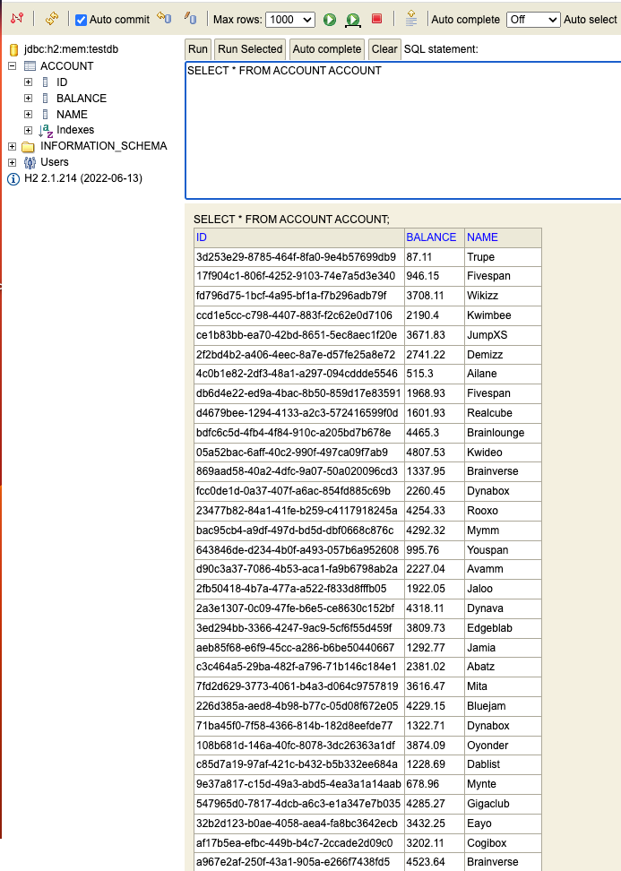
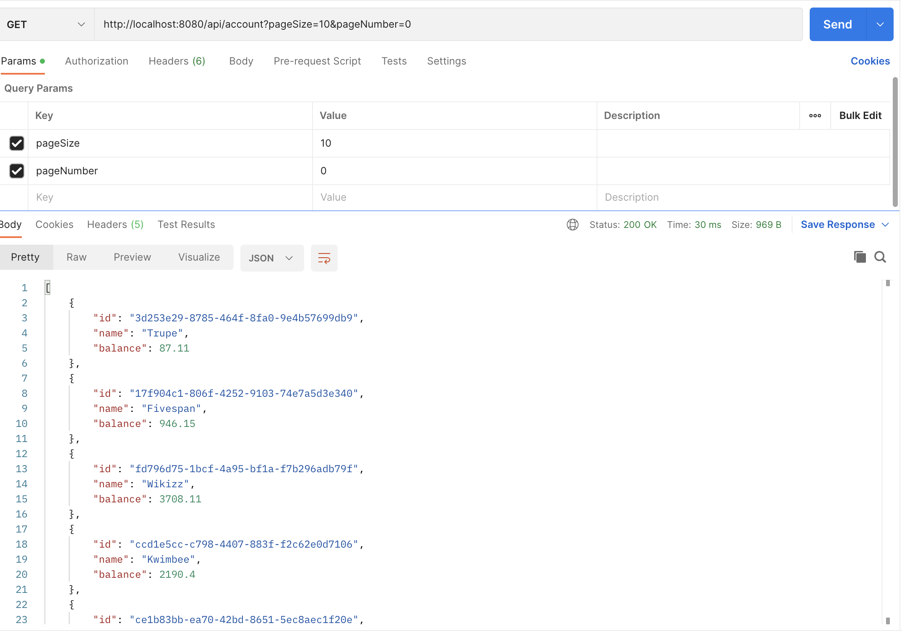
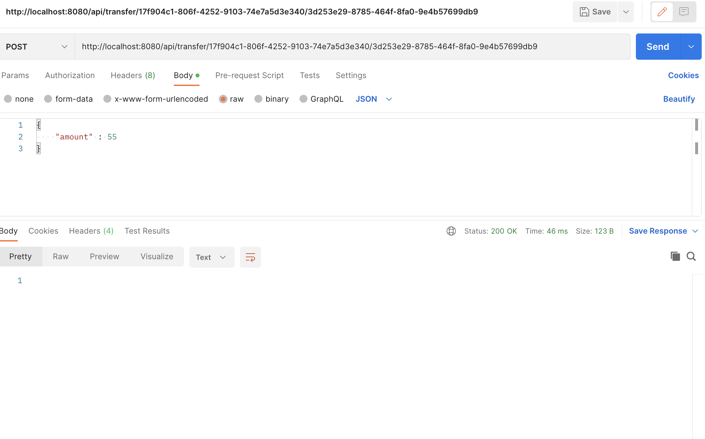
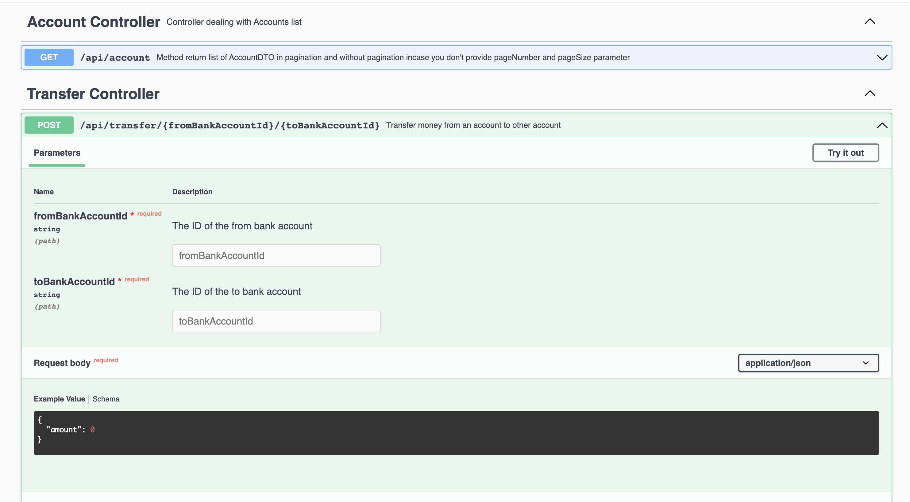

# Account Service

A service that emulates a RESTful API (including data model and the backing implementation)
for money transfers between accounts.

### Technology used
* Java 17
* Maven
* SpringBoot
* Spring Web
* Swagger
* Javax Validation
* Lombok
* Transaction Management

### How to run
Just run this command on CLI `mvn spring-boot:run`

### Internally How it's work
JSON file inside ``resources/json/accounts-mock.json`` containing list of account with ID, Name and Balance. Accounts must be
This service parsed from the file and ingested into your application during startup. After importing data User able to transfer fund between users(Credit and Debit).
Technically AccountComponent is class which implemented ApplicationRunner, and it will run once when application startup.
Good things in this solution covering approx 100% code coverage.

Data from account-mocks.json will be loaded after server started and stored into In Memory Database

### Request URL (Postman)

#### * Request URL for to Get All accounts

`curl --location 'http://localhost:8080/api/account'`

#### * Request URL for to Get All accounts with Pagination

  `curl --location 'http://localhost:8080/api/account?pageSize=10&pageNumber=0'`

#### *Request URL for Transfer fund from one Account into Another one

`curl --location 'http://localhost:8080/api/transfer/17f904c1-806f-4252-9103-74e7a5d3e340/3d253e29-8785-464f-8fa0-9e4b57699db9' \
  --header 'Content-Type: application/json' \
  --data '{
  "amount" : 55
  }'`

#### * SwaggerUI

`http://localhost:8080/swagger-ui/index.html`

